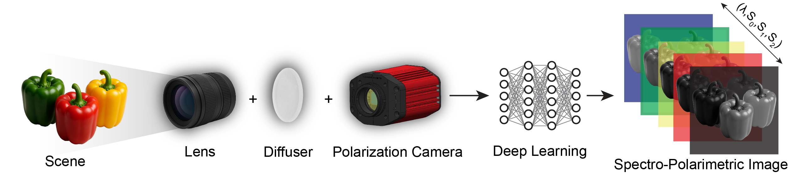

<div align="center">
    <h1>DiffuserNET</h1>
    <h3>Hyperspectral Polarimetric Image Reconstruction</h3>
    
    
</div>

<p align="center">
    <b>System Schematic:</b><br>
    
</p>

DiffuserNET is a machine learning framework for reconstructing hyperspectral images from single-shot, linearly polarized, greyscale images acquired through a diffuser. The figure above illustrates the core idea: a scene is imaged polarimetrically through a diffuser, producing a spatially-mixed polarized scatterogram, which is then used to reconstruct the full hyperspectral information of the scene.


- **Input:** (5, 660, 660) multi-channel diffusive image from the polarimetric camera:
    - 4 linear polarization channels
    - 1 unprocessed channel
    - Spectral information is spatially mixed by a diffuser
- **Output:** (106, 128, 128) polarized hyperspectral cube:
    - Each channel corresponds to a wavelength (450–850nm, 4nm steps), matching "cubert" ground truth
- **Goal:** Reconstruct the full hyperspectral polarimetric image cube from a single compressed polarimetric input

**Implementation:** Based on the [pix2pix GAN framework](https://github.com/junyanz/pytorch-CycleGAN-and-pix2pix) with custom losses and dataloader. See `models/pix2pix_model.py`, `models/networks.py`, and `data/aligned_dataset.py` for details.

## Model & Training Pipeline

### How the Generator and Discriminator Work

DiffuserNET uses a U-Net generator and PatchGAN discriminator, trained adversarially to reconstruct hyperspectral images from compressed, single-polarization greyscale inputs:

- **Generator (U-Net):** Receives a single polarization channel (shape: (1, 660, 660)), decodes the spatially mixed spectral information, and outputs a hyperspectral cube (shape: (106, 128, 128)). Trained to produce outputs close to ground truth (L1, SSIM, spectral correlation losses) and realistic (adversarial loss).
- **Discriminator (PatchGAN):** Receives the concatenation of the (resized) input and either the real or generated hyperspectral cube, and learns to distinguish real (input + ground truth) from fake (input + generated) pairs, providing feedback to the generator.
- **Training:** The generator tries to fool the discriminator, while the discriminator tries to correctly identify real vs. generated pairs. The adversarial loss encourages realism, while other losses ensure spectral and spatial accuracy. Four separate models are trained, one for each polarization channel.
- **Testing & Evaluation:** After training, the model is evaluated on unseen validation images. Test reconstructions are saved to `results/<dataset_name>/validation_latest/images/`, and quantitative metrics (SSIM, MSE, MAE, RASE, spectral fidelity, etc.) are computed and saved as `metrics.csv` (see `HSI_comparison.py`).

## Data Organization

Your data directory should be structured as follows:

```
<dataset_root>/
    training/
        thorlabs/
            image_0_thorlabs.tif
            image_1_thorlabs.tif
            ...
        cubert/
            image_0_cubert.tif
            image_1_cubert.tif
            ...
    validation/
        thorlabs/
            ...
        cubert/
            ...
```

- **thorlabs/**: (5, 660, 660) tiff images (greyscale, 4 polarizations + unprocessed)
- **cubert/**: (106, 120, 120) tiff images (hyperspectral ground truth)
- Images are paired by index (e.g., `image_0_thorlabs.tif` and `image_0_cubert.tif`)

---

## Environment Setup (CHPC or related cluster)

1. **Clone the repository:**
   ```bash
   git clone <repo_url>
   cd DiffuserNET
   ```
2. **Create the conda environment:**
   ```bash
   conda env create --prefix ./hsp_env -f hsp_env.yml
   conda activate ./hsp_env
   ```

## Training & Testing Example

See `banknotes_training.sh` for a full SLURM batch script example. Key steps:

```bash
# Activate environment
source activate ./hsp_env

# Train
python train.py \
    --dataroot <dataset_root> \
    --name <experiment_name> \
    --checkpoints_dir <checkpoint_dir> \
    --model pix2pix \
    --input_nc 1 \
    --output_nc 106 \
    --n_epochs 10 \
    --n_epochs_decay 10 \
    --save_epoch_freq 5 \
    --netG unet_1024 \
    --netG_reps 2 \
    --netD_mult 0 \
    --polarization 0 \
    --norm_bitwise

# Test
python test.py \
    --dataroot <dataset_root> \
    --name <experiment_name> \
    --checkpoints_dir <checkpoint_dir> \
    --model pix2pix \
    --input_nc 1 \
    --output_nc 106 \
    --netG unet_1024 \
    --netG_reps 2 \
    --netD_mult 0 \
    --polarization 0 \
    --norm_bitwise
```

- Replace `<dataset_root>`, `<experiment_name>`, and `<checkpoint_dir>` as needed.
- Repeat for each polarization (0, 45, 90, 135) or utilize batch_train_test.py

## Evaluation

After testing, evaluate results with:
```bash
python HSI_comparison.py --results_dir results/<dataset_name>/validation_latest/images
```
This script computes SSIM, MSE, MAE, RASE, spectral fidelity, and other metrics, saving them to `metrics.csv`.

**Visualization:**
Both `HSI_comparison.py` (for CHPC) and `HSI_comparison_local.py` (for local use) also provide an interactive visualization tool. This allows you to visually inspect (wavelengths & sRGB) and compare the reconstructed and ground truth hyperspectral images, explore spectra at individual pixels, and better understand model performance beyond summary metrics.

<p align="center">
    <b>Example Output and ROI Spectral Comparison:</b><br>
    <br>
    <i>
        Example visualization: The top row shows the scatterogram input, ground truth, and reconstructed hyperspectral frames. Three regions of interest (ROIs) are highlighted, with plots comparing the ground truth and reconstructed spectra at each ROI. The figure also includes sRGB reconstructions (using the HSI_comparison script) for visual comparison in standard color space.
    </i>
</p>


## File Reference

- `models/` — Model architectures (U-Net, Pix2Pix, etc.)
- `data/aligned_dataset.py` — Dataloader, polarization selection, normalization, upsampling/padding
- `HSI_comparison.py` — Evaluation metrics and batch comparison
- `image_preprocessing/` — Data augmentation, alignment, and splitting scripts
- `banknotes_training.sh` — Example SLURM script for training/testing
- `hsp_env.yml` — Conda environment file


## Notes
- All training and testing was performed on the CHPC cluster, using SLURM for job scheduling.
- Model checkpoints and large data should be stored on `/scratch` for speed; code and results can be kept in your home directory (`/uufs`/Z:).
- The project is designed for reproducibility: all scripts, environment files, and data conventions are included here.

## Citation

If you use this code or data, please cite the original authors and this repository. For the associated research paper, please use the following placeholder citation until the official publication is available:

> Max T. Krauss, Jakob Damman, William Walker, Al Ingold, Apratim Majumder, Rajesh Menon. "Diffuser-based Hyperspectral Imaging with Polarimetric Angular Sensing." (Manuscript in preparation, 2025).


---

## Credits & License

This repository is developed and maintained by Max Krauss (2025), University of Utah. Built upon the open-source [pix2pix framework](https://github.com/junyanz/pytorch-CycleGAN-and-pix2pix) by Jun-Yan Zhu et al.

This project is licensed under the MIT License. See the LICENSE file for details.

---


